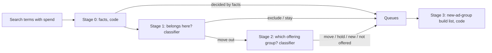

# Build plan: search-term triage pipeline with a classifier

Status: draft for review, not built. Written 2026-09-28.
Scope: the weekly search-term pass (GTA task T13: every search term with spend ends in one action) rebuilt so a cheap classifier (TypeSafe Jev, through classifier-skill) does the per-term judgment and code does everything else. Both the pipeline and the classifier-facing pieces are expected to change as we learn; section 10 says how changes are absorbed.

Related: `docs/caller-integration-plan.md` (how any skill calls the classifier). Account names are kept out of this file; results by account live in local, uncommitted backtest folders.

---

## 1. What we learned (evidence behind the plan)

Two backtests, 2026-09-26 to 28, each scored against the owner's blind labels.

| Round | What the classifier was asked | Action accuracy vs owner | Notes |
|---|---|---|---|
| Account A (cosmetic surgeon), v1-v2 | pick the action directly | Jev 49%, working model (Opus) 44% | account history was a poor label source: of 60 "no action" terms the owner would act on 58 |
| Account B (cosmetic surgeon), v3 | pick the action directly, 5 options | Jev 38%, Opus 32% | owner could not tell "new ad group" from "other ad group" without a list of the business's offerings; nor could the models |
| Account B, v4-v5 | name the offering the term is about; code picks the action from the account's catalog | **Jev 84%, Opus 85%** | Jev's confident exclusions 11 of 11 correct; all exclusions 95% precise; Jev cost $0.007 and 65 s per 80 terms vs ~100k tokens for Opus |

Error analysis of the v5 misses (11 of 67):
- 5: near-duplicate catalog entries that lead to different actions (implant-options page vs the breast-augmentation ad group; chin liposuction vs submental liposuction).
- 3: policy calls that code or the account should make (distance, other specialties, filler vs surgery).
- 2-3: label noise or unreadable terms. 16% of terms were ambiguous even to the owner.

**Conclusion:** most of the remaining error is structural, not the classifier's judgment. Fix the structure and measure again.

---

## 2. Key decisions and why

| # | Decision | Reasoning |
|---|---|---|
| D1 | The classifier answers only "what is this term about?" and narrow yes/no gates. Code decides every action. | Asking for the action made both the classifier and a human guess facts about the account (which offerings exist, which have ad groups). Asking for the offering doubled accuracy (38% to 84%). Actions are rules; rules belong in code. |
| D2 | Split the pass into stages: facts (code), "does it belong here?", "where does it go?", and a new-ad-group build list. | Each question gets few, clear options; each error is traceable to one stage; each stage gets its own threshold and calibration. Mirrors how the owner works: triage first, routing second, building later. |
| D3 | Facts are computed, never asked: conversion, brand and principal names, competitor names, language, location vs service area, keyword coverage. | The classifier cannot do arithmetic or lookups reliably, and a lookup is free and exact. Every fact taken out of a question removes a source of error. |
| D4 | Offerings are grouped into **offering groups**, one per ad-group-level offering; the classifier chooses among groups (about 20 for a typical account), not pages (64). | Near-duplicate pages were the largest error source (5 of 11). A group is what routing needs. |
| D5 | Each account has a **catalog** built by code from sources of record (sitemap: a live landing page means offered; the ads account: an ad group means offered) and confirmed by the owner. | The owner could not label without it, and neither could the models. Code builds it cheaply; a person confirms it once. |
| D6 | **General ad groups** (e.g. "cosmetic surgery") take no specific-offering term by default, but an account may **hold** such terms there while a new ad group is pending (`hold_new_in_general`). Held terms stay on the build list. | The owner sometimes delays building ad groups; clicks must still land somewhere sensible, and nothing may be lost. |
| D7 | **Service area** is declared as cities, zip codes, or a radius, and expanded to a lookup list when the catalog is built. **Customer reach** (`local` or `extended`) is set per account with a per-offering-group override. | Botox is local; a deep-plane facelift draws customers from far away. A lookup at run time is exact and needs no model or network. |
| D8 | Code uses industry-neutral words: `business`, `customer`, `offering`, `principal`, `competitor`. Industry words (patient, procedure, surgeon) appear only in question text sent to the classifier and in the labeling UI, rendered from a `vocabulary` block. | The pipeline must serve any business (a mortgage lender as well as a surgeon). The classifier reads literally, so the question text may use the industry's words; identifiers never do. |
| D9 | Classify each business by `sector` > `industry` > `category`, with the category taken from its primary **Google Business Profile** category (a stable `gcid:` id). Behavior is keyed by a fourth field, **`market`**: who the business serves. | Categories can differ where customers do not: a cosmetic surgeon and a plastic surgeon differ by credential but serve identical customers searching identical terms. Credential matters for ad-copy compliance, not for search-term triage. |
| D10 | Playbooks (rules, vocabulary) and calibration sets belong to a **market**, inheriting from sector and industry. | Owner labels transfer across every business in the same market; a new category in a known market needs QA only, not a new labeling round. |
| D11 | Owner labeling is an onboarding step per market, not a permanent step. A QA agent trained on the owner's labels and notes reviews samples; the owner is pulled back only when QA agreement drops or a new market or pattern appears, and then labels only the terms the models disagree on. | The owner wants an agent that judges like them. Labels plus notes become the playbook and the calibration set; disagreement-driven labeling teaches the most per label. |
| D12 | The 95% target is **95% precision on answers the pipeline automates, at a stated minimum coverage, per stage**; the rest goes to review. | 16% of terms are ambiguous even to the owner; 95% on every term is not a meaningful goal, and a precision goal without a coverage floor can be met by automating nothing. |
| D13 | The pipeline belongs to the calling skill (gta-account-optimization), not to classifier-skill; classifier-skill only supplies the engine and the generic `catalog-lookup` recipe. | Keeps the classifier free of any caller's domain rules (caller integration plan, section 7). |

---

## 3. Vocabulary

| Concept | Code name | Health example | Mortgage example |
|---|---|---|---|
| The advertiser | `business` | practice | lender |
| Who buys | `customer` | patient | borrower |
| What is sold | `offering` | procedure, treatment | loan program |
| Offerings that route to one ad group | `offering_group` | "liposuction" | "FHA loans" |
| A person searched by name | `principal` | surgeon | loan officer |
| Another business | `competitor` | other surgeon or practice | other lender |
| Who the business serves | `market` | aesthetic surgery | mortgage lending |
| The Google Ads account | `ads_account` | | |

Kept as-is because they are the platform's own words, not an industry's: campaign, ad group, keyword, search term, negative keyword.

Renames in existing prototype files: `services` to `offerings`; option ids `practice_by_name` to `business_by_name`, `general_surgery` to `general_category`.

---

## 4. Data model

**Business profile** (per business, owner-confirmed):
```json
{
  "business": "account-b",
  "ads_accounts": ["0000000000"],
  "sector": "healthcare", "industry": "medical_practice",
  "category": "gcid:cosmetic_surgeon", "credential": "cosmetic",
  "market": "aesthetic_surgery",
  "business_names": ["..."], "principal_names": ["..."],
  "languages": ["en", "es"],
  "service_area": {"cities": ["..."], "zips": [], "radius": {"center": "...", "miles": 25}},
  "customer_reach": "local",
  "hold_new_in_general": {"enabled": false, "until": null}
}
```

**Catalog** (per business, built by code, confirmed by the owner, versioned):
```json
{
  "offering_groups": [
    {"id": "liposuction", "name": "liposuction", "aliases": ["lipo", "liposuccion"],
     "pages": ["/body/liposuction/"], "active_ad_groups": ["Liposuction"], "customer_reach": null},
    {"id": "facelift", "name": "facelift", "aliases": ["deep plane facelift"],
     "pages": ["/face/facelift/"], "active_ad_groups": [], "customer_reach": "extended"}
  ],
  "brand_ad_groups": ["..."], "general_ad_groups": ["..."],
  "service_area_expanded": {"cities": ["..."], "zips": ["..."]}
}
```

**Market playbook** (per market, inheriting sector and industry):
```yaml
market: aesthetic_surgery
vocabulary: {customer: patient, offering: procedure, principal: surgeon}
rules:
  - exclude: a search for a surgeon of a different gender than every principal
  - exclude: another specialty's practitioner (e.g. oculoplastic surgeon)
  - not_offered: "liquid rhinoplasty" is a filler treatment, not surgery
calibration_set: labels/aesthetic_surgery/*.jsonl
thresholds: {stage1.cannot_win: 0.8, stage1.belongs_here: 0.8, stage2.offering_group: 0.6}
```

---

## 5. Pipeline



| Stage | Who | Input | Output |
|---|---|---|---|
| 0. Facts | code, pure functions | term, triggering ad group, profile, catalog | converted; brand or principal match; competitor match; language; in or out of service area; covered by the ad group's keywords; exact alias match to an offering group |
| 1. Belongs here? | classifier: `cannot_win` (yes/no), `belongs_here` (yes/no, the ad group's offering-group description on the card) | terms not decided by facts | code: **exclude** (cannot win, not converted), **stay** (add keyword, or ignore when covered), or **move out** |
| 2. Where does it go? | classifier: one choice over offering groups plus `business_by_name`, `general_category`, `not_offered`, `none_fit`, `insufficient_context`; a category step first when an account has more than about 30 groups | move-out terms | code: group has an active ad group, **move there**; offered with no ad group, **hold in general** when enabled, else **new ad group queue**; not offered, **exclusion queue for review**; then the reach check (out of area and group is `local`, **exclude**) |
| 3. Build list | code | new-ad-group queue plus held terms | per offering group: terms, cost, landing page; only groups in the catalog |

Queues: stay (add keyword / ignore), move, hold, new-ad-group, exclude (proposed negatives), review. Nothing is applied to an ads account without the owner's approval.

---

## 6. Modules

| Module | Interface | Hides | Jev-tied? |
|---|---|---|---|
| `profile` | `load(business)` | profile file, inheritance of market playbook | no |
| `catalog` | `build(business) -> catalog`, `diff(old, new)`, `validate` | sitemap fetch, ads-account read, grouping, alias lists, service-area expansion | no |
| `facts` | `facts(term, profile, catalog) -> dict` (pure) | every stage 0 rule | no |
| `questions` | `stage1(profile, catalog)`, `stage2(profile, catalog)` -> question sheets | question wording, vocabulary rendering, thresholds | **yes** (shape of the classifier's questions) |
| `judge` | `judge(sheet, items) -> answers` | the classifier call: today `classify_items.py` from classifier-skill | **yes** (the only place a model is called) |
| `rules` | `resolve1(...)`, `resolve2(...)` (pure) | every action decision | no |
| `run` | `run(business, window) -> queues` | stage order, batching, queue files | no |
| `score` | `score(labels, run)` per stage and end to end | calibration and QA reports | no |

Only `questions` and `judge` know about the classifier. Swapping Jev for another model, or dropping a stage, changes those two and the thresholds, nothing else.

Where things live (proposed): the pipeline in the gta-account-optimization skill's repository (needs the owner's go-ahead); profiles, catalogs, and playbooks as data next to it; the engine stays in classifier-skill.

---

## 7. Calibration and QA

- **Onboarding a new market:** the owner labels one round (80-150 terms) in the labeling page: stage 1 label (stay, move out, not a customer) and stage 2 label (offering group). Notes become playbook rules. Thresholds are set per stage on a tuning split and reported once on a held-out split.
- **A new business in a known market:** no labeling; QA sampling only.
- **Weekly:** the QA agent (a working model given the market playbook and the owner's labeled examples) reviews a sample and every term where the classifier's confidence is low or the QA agent disagrees.
- **Pulling the owner back in:** when QA agreement with the calibration set drops below its bar, or a new pattern appears; the owner then labels only disagreement terms.
- **QA agent acceptance:** it must match the owner's labels about as well as a second human would, before it replaces owner review.

---

## 8. Build phases

| Phase | Work | Done when |
|---|---|---|
| 1 | Vocabulary renames in prototype files; `profile` and `catalog` modules; offering groups and aliases; service-area expansion; catalog diff | Account B catalog rebuilt as offering groups; owner confirms it |
| 2 | `facts` module with tests (brand, competitor, language, location, coverage, reach) | unit tests pass; stage 0 decides some terms outright on account B |
| 3 | Stage 1 and stage 2 question sheets, `rules`, `run` | account B's 80 labeled terms rescored per stage and end to end against the owner's labels (converted to stage labels); target: 95% precision on automated answers per stage, coverage reported |
| 4 | Market playbook for aesthetic surgery from the owner's notes; vocabulary rendering | owner confirms the playbook |
| 5 | Fresh test: a new week on account B, plus account C (plastic surgeon, same market, no new labeling), owner spot-checks | precision holds on unseen terms and a second business |
| 6 | QA agent, drift check, disagreement queue | QA agent's agreement with owner labels meets its bar |
| 7 | Move into the gta repository; advisory weekly run (proposals only, owner approves) | first approved weekly change list |

Phases 1-3 are the smallest test of the structural hypothesis. Stop and reassess if phase 3 does not beat v5 (84%).

---

## 9. Risks

| Risk | Mitigation |
|---|---|
| Overfitting to 147 labels from one owner | fresh week and a second business before automating (phase 5); a second labeler when available |
| The catalog sets the accuracy ceiling | code builds it from sources of record; owner confirms; rebuilds show a diff |
| Errors compound across stages (a wrong "stay" hides a move) | score each stage and end to end; low-confidence "stay" goes to review |
| General ad groups absorb everything | default: specific-offering terms move out; holding is an explicit, dated setting |
| Market boundaries drawn wrong | market mapping is data; a split or merge re-runs calibration for the affected market only |
| Classifier or model change | versions recorded with every result; a change sends each stage back to calibration |
| Owner time | labeling only at market onboarding and on QA drift, and only on disagreement terms |

---

## 10. How change is absorbed

We expect to change both the pipeline and the classifier pieces as results come in.

- **Everything that decides is versioned and recorded with each result:** profile, catalog, market playbook, question sheet, model, and contract version.
- **Recalibrate a stage when** its question sheet, the model, or the catalog's offering groups change; not when a profile's names or service area change (facts are exact).
- **Classifier-facing code is two modules** (`questions`, `judge`); replacing or removing the classifier touches only those.
- **Labels are stored as stage labels** (stay / move out / not a customer; offering group), not as actions, so they stay valid when the action rules change.
- **Every change is scored** against the stored labels before it ships; a change that lowers per-stage precision does not ship.

---

## 11. Open questions

1. Market list and mapping from GBP categories: who maintains it, and where.
2. Radius service areas: which gazetteer to expand against (a one-time build step).
3. The minimum coverage that makes a stage worth automating (per stage), alongside the 95% precision bar.
4. Spanish (and other language) routing: separate ad groups linked to language pages, or the same ad groups.
5. Where the QA agent runs and what its agreement bar is.
